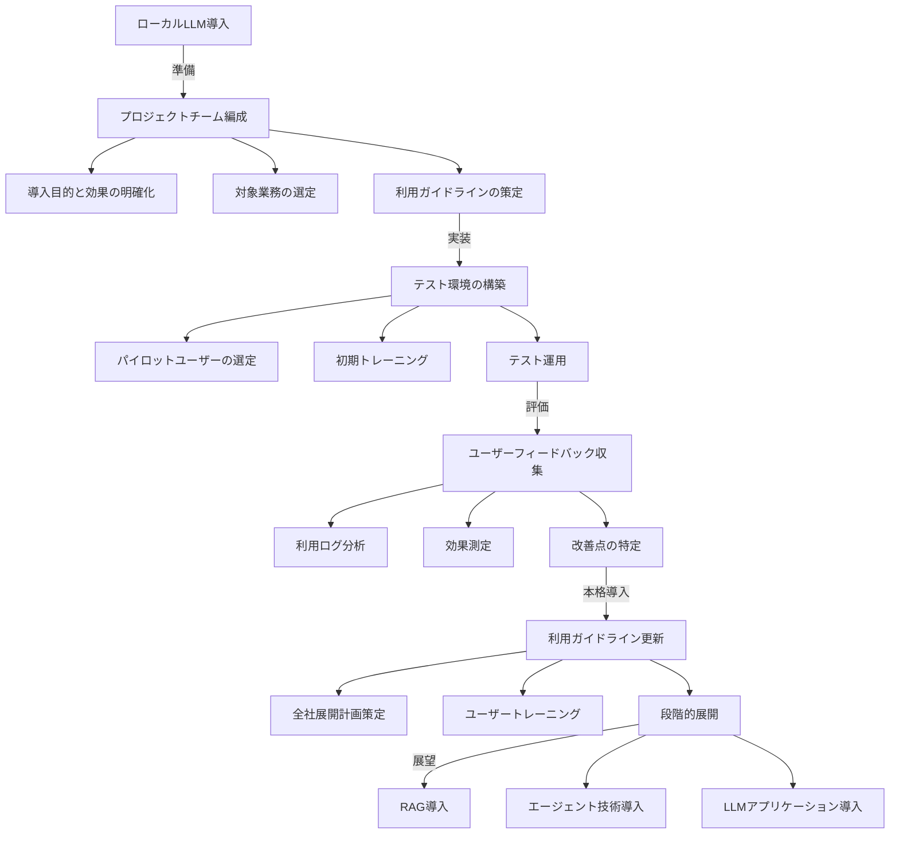
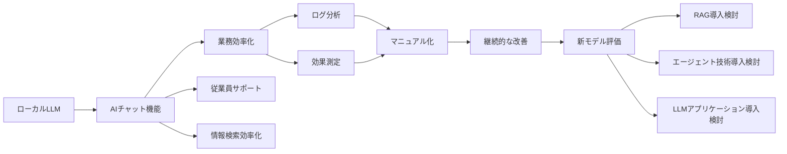
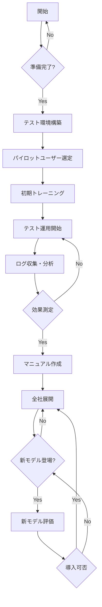

# doc_genai_About_the_introduction_procedure_for_business_use_of_LocalLLM
ローカルLLMの業務利用導入手順について

## ローカルLLM導入手順書

- [目次](#目次)
- [1. 前提条件](#1-前提条件)
- [2. 導入の概要](#2-導入の概要)
    - [2.1 目標](#21-目標)
    - [2.2 検証段階](#22-検証段階)
    - [2.3 運用段階](#23-運用段階)
    - [2.4 管理段階](#24-管理段階)
    - [2.5 展望](#25-展望)
- [3. 導入手順](#3-導入手順)
    - [3.1 準備フェーズ](#31-準備フェーズ)
    - [3.2 実装フェーズ](#32-実装フェーズ)
    - [3.3 評価フェーズ](#33-評価フェーズ)
    - [3.4 本格導入フェーズ](#34-本格導入フェーズ)
- [4. 構成図 (mermaid構文)](#4-構成図-mermaid構文)
- [5. 関係図 (mermaid構文)](#5-関係図-mermaid構文)
- [6. フローチャート (mermaid構文)](#6-フローチャート-mermaid構文)
- [7. 注意事項](#7-注意事項)
- [補足](#補足)

### 1. 前提条件

- **ローカルLLMの利用**: 本手順書では、クラウドベースではなく、自社のサーバや端末にLLMをインストールし、直接利用することを前提としています。
- **機器の選定**: LLMを稼働させるためのハードウェア（CPU、GPU、メモリなど）が決定済みであること。
- **モデルの選定**: 利用するLLMモデル（サイズ、性能など）が決定済みであること。
- **AIチャット環境構築**: ローカル環境でLLMを用いたAIチャット機能が利用できる状態であること。

### 2. 導入の概要

#### 2.1 目標

ローカルLLMによるAIチャット機能を導入し、業務効率化を実現することを目指します。具体的には、以下のような効果が期待されます。

- **業務プロセスの自動化**: 繰り返し作業や定型業務の自動化により、人的なミスを減らし、業務効率を向上させます。
- **従業員サポート**: 従業員が業務の疑問点や困りごとをAIチャットに質問することで、迅速な回答を得ることができ、業務の円滑な遂行を支援します。
- **情報検索の効率化**: AIチャットを利用することで、必要な情報に素早くアクセスでき、情報収集時間の短縮を実現します。

#### 2.2 検証段階

- **検証期間**: 一定期間、実際の業務にAIチャット機能を導入し、その効果を検証します。
- **ログ分析**: 会話履歴を分析することで、AIチャットがどのように活用されているかを把握します。
- **業務成果との比較**: 会話履歴と業務成果を比較することで、AIチャットの導入による具体的な効果を測定します。
- **効果検証**: どの業務プロセスに効果が期待できるのか、詳細な分析を行い、検証結果に基づいて導入範囲を検討します。

#### 2.3 運用段階

- **マニュアル化**: 検証結果を基に、AIチャット機能の利用方法や注意点などをまとめたマニュアルを作成します。
- **展開**: 作成したマニュアルを社内に展開し、従業員への教育を実施します。
- **継続的な改善**: 継続的にログと業務成果を分析し、AIチャットの精度向上や利用方法の改善を図ります。必要に応じてマニュアルを更新します。

#### 2.4 管理段階

- **新モデルの評価**: 新しいLLMモデルが登場した場合、それらを評価し、導入の可否を判断します。
- **評価体制の構築**: 新モデルを評価するための体制を構築します。
- **評価手順の整備**:  評価用プロンプトの蓄積、一括実行、一括評価、チェックリストなど、評価手順を整備します。

#### 2.5 展望

- **RAG(Retrieval-Augmented Generation)導入**: LLMに外部データへのアクセス機能を追加することで、より精度の高い回答を得られるようにします。
- **エージェント技術導入**: AIチャット機能を拡張し、複数のシステムやサービスと連携することで、より複雑な業務プロセスを自動化します。
- **LLMアプリケーション導入**: 様々なLLMアプリケーションを導入することで、業務効率化の幅を広げます。

### 3. 導入手順

#### 3.1 準備フェーズ

1. **プロジェクトチームの編成**: 導入計画の立案、検証、運用、管理などを担当するプロジェクトチームを編成します。
2. **導入目的と期待効果の明確化**: ローカルLLM導入によって実現したい具体的な目的と期待される効果を明確にします。
3. **対象業務の選定**: AIチャット機能を導入する対象となる業務プロセスを特定します。
4. **利用ガイドラインの策定**: AIチャット機能の利用に関する社内ガイドラインを策定します。

#### 3.2 実装フェーズ

1. **テスト環境の構築**: ローカルLLMとAIチャット機能が動作するテスト環境を構築します。
2. **パイロットユーザーの選定**: 試験導入を行うパイロットユーザーを特定し、実際にAIチャット機能を利用してもらい、フィードバックを収集します。
3. **初期トレーニングの実施**: AIチャット機能の精度を高めるために、初期トレーニングを行います。
4. **テスト運用の開始**:  選定されたパイロットユーザーでテスト運用を開始し、ログ収集と効果検証を行います。

#### 3.3 評価フェーズ

1. **ユーザーフィードバックの収集**: パイロットユーザーからAIチャット機能に関する意見や改善点を収集します。
2. **利用ログの分析**: ログデータに基づいて、AIチャット機能の利用状況を分析します。
3. **効果測定**: ログデータと業務成果を比較分析し、AIチャット導入による具体的な効果を測定します。
4. **改善点の特定**:  分析結果に基づいて、AIチャット機能の改善点などを特定します。

#### 3.4 本格導入フェーズ

1. **利用ガイドラインの更新**:  評価フェーズでのフィードバックを反映し、利用ガイドラインを更新します。
2. **全社展開計画の策定**:  本格導入に向けた全社展開計画を策定します。
3. **ユーザートレーニングの実施**:  全従業員に対して、AIチャット機能の使い方や注意点などを説明するトレーニングを実施します。
4. **段階的な展開**:  業務プロセスごとに段階的にAIチャット機能を導入していきます。

### 4. 構成図 (mermaid構文)

### 5. 関係図 (mermaid構文)

### 6. フローチャート (mermaid構文)

### 7. 注意事項

- **データセキュリティ**:  ローカルLLMを利用する際は、データセキュリティ対策を徹底する必要があります。
- **プライバシー保護**:  個人情報や機密情報を含むデータを取り扱う場合は、プライバシー保護対策を講じる必要があります。
- **倫理的な利用**:  AIチャットは倫理的な観点から利用する必要があります。差別的な発言や偏見を含む回答を生成しないよう、適切な対策を講じる必要があります。
- **継続的な技術動向の監視**:  AI技術は日々進化しています。最新の技術動向を常に把握し、必要に応じてシステムを更新する必要があります。

## 補足

本手順書はあくまでも下書きであり、実際に導入する際には、組織の規模、業務内容、セキュリティ対策など、様々な要素を考慮する必要があります。必要に応じて、手順や内容を調整してください。
